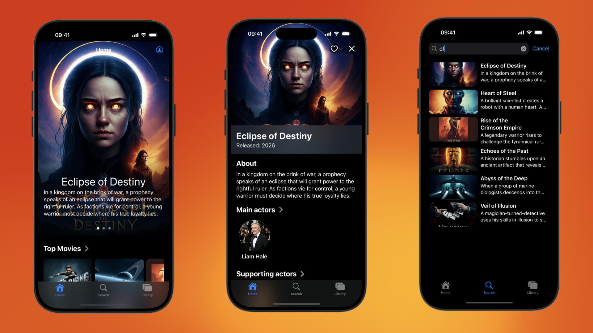

# FriendlyFlix



## Introduction

This quickstart is a movie tracker app to demonstrate the use of Firebase Data Connect
 with a Cloud SQL database.

For more information about Firebase Data Connect visit [the docs](https://firebase.google.com/docs/data-connect/).


## Prerequisites

To use this quickstart, you'll need the following:
- A computer running macOS
- The latest version of [Xcode](https://developer.apple.com/xcode/)
- The latest version of [Visual Studio Code](https://code.visualstudio.com/)
- The [Firebase Data Connect VS Code Extension](https://marketplace.visualstudio.com/items?itemName=GoogleCloudTools.firebase-dataconnect-vscode)
- The latest version of the [Firebase CLI](https://firebase.google.com/docs/cli#update-cli)

## Getting Started (local development)

Follow these steps to get up and running with Firebase Data Connect locally (i.e., without setting up a production SQL instance). At the end of this guide, you will find instructions for connecting to a production SQL instance.

For more detailed instructions,
check out the [official documentation](https://firebase.google.com/docs/data-connect/quickstart-local).


### 1. Create a Firebase project

1. If you haven't already, create a Firebase project.
    * In the [Firebase console](https://console.firebase.google.com), click
        **Create a project**, then follow the on-screen instructions.

### 2. Get the code for the FriendlyFlix quickstart app

1. Clone this repository to your local machine:
   ```sh
   git clone https://github.com/firebase/data-connect-ios-sdk
   ```

### 3. Open in Visual Studio Code (VS Code)

1. Open the `data-connect-ios-sdk/Examples/FriendlyFlix` directory in VS Code.
2. Click on the **Firebase Data Connect** icon on the VS Code sidebar to load the Firebase Data Connect Extension.
   a. Sign in with your Google Account if you haven't already.
3. Click on **Connect a Firebase project** and choose the project you created in the first step.
4. Click on **Start emulators**.

### 4. Populate the database
In VS Code, open the `data-connect-ios-sdk/Examples/FriendlyFlix/dataconnect/data_seed.gql` file and click the
 **Run (local)** button at the top of the file.

If you'd like to confirm that the data was correctly inserted,
open `data-connect-ios-sdk/Examples/FriendlyFlix/dataconnect/movie-connector/queries.gql` and run the `ListMovies` query.

### 5. Run the app

1. Open `data-connect-ios-sdk/Examples/FriendlyFlix/app/FriendlyFlix/FriendlyFlix.xcodeproj` in Xcode
2. Wait for all packages to be resolved.
3. Select one of the iPhone Simulators as the run destination.
4. Press the **Run** button in Xcode to run the sample app on the iOS Simulator.

> [!NOTE]
> If you've used Firebase before, you might be wondering why you didn't have to download the
> `GoogleService-Info.plist` file. This file is only required when connecting your app to a Firebase
> project in the cloud, which you will do in the section.

## Connect to a production instance of CloudSQL

Once you've sucessfully run the app locally, you can set up a production instance of CloudSQL in your Firebase project and deploy your Firebase Data Connect schema.

### 1. Connect to your Firebase project

1. If you haven’t already, add an iOS app to your Firebase project
    * On the [Overview page](https://console.firebase.google.com/project/_/overview) of your Firebase project in the [Firebase console](https://console.firebase.google.com), click the **iOS+** icon to add your project, using `com.google.firebase.samples.FriendlyFlix` as the bundle ID (you can leave the *App nickname* and *App Store ID* blank)
    * Click **Register app**.
    * Click **Download GoogleService-Info.plist** to obtain your Firebase config file.

2. Move the `GoogleService-Info.plist` config file (downloaded in the previous step) into the root folder of the sample app in the
  `data-connect-ios-sdk/Examples/FriendlyFlix/app/FriendlyFlix/FriendlyFlix/GoogleService-Info.plist` directory, replacing the existing `GoogleService-Info.plist` (which contains dummy values).

3. In the Firebase console, finish the **Add Firebase to your Apple app** flow by skipping over steps 3,4, and 5 - these were already done for you.

### 2. Upgrade your Firebase project to Blaze

1. Upgrade your project to the Blaze plan. This lets you create a Cloud SQL
    for PostgreSQL instance.

    > Note: Though you set up billing in your Blaze upgrade, you won't be
    charged for usage of Firebase Data Connect or the
    [default Cloud SQL for PostgreSQL configuration](https://firebase.google.com/docs/data-connect/#pricing) during the preview.

### 3. Enable Firebase Authentication

To be able to sign in to the application, you need to enable Firebase Authentication for your Firebase project.

1. In the Firebase console, navigate to the [Authentication section](https://console.firebase.google.com/project/_/authentication)
2. Click on **Get started** to enable Firebase Authentication
3. Click on **Email/Password**, then click on **Enable**, and then **Save** to enable Email/Password authentication for your project

### 4. Provision a PostgreSQL database

1. Navigate to the [Data Connect section](https://console.firebase.google.com/project/_/dataconnect)
    of the Firebase console, click on the **Get started** button and follow the setup workflow:

   - Select **Create new Cloud SQL instance**, and click **Next*.
   - Select a location for your Cloud SQL for PostgreSQL database (this sample uses `us-central1`). If you choose a different location, you'll also need to change the `data-connect-ios-sdk/Examples/FriendlyFlix/dataconnect/dataconnect.yaml` file.
   - Fill in the following fields for the **data source**:
       - Cloud SQL Instance ID: `fdc-sql`
       - Database name: `fdcdb`
       - Service ID: `dataconnect`
2. Allow some time for the Cloud SQL instance to be provisioned. After it's provisioned, the instance
   can be managed in the [Cloud Console](https://console.cloud.google.com/sql).

### 5. Deploy your schema to production

1. Open the `data-connect-ios-sdk/Examples/FriendlyFlix` directory in VS Code.
2. Click on the Firebase Data Connect icon on the VS Code sidebar to load the Extension.
   a. Sign in with your Google Account if you haven't already.
   b. Ensure the project you created in the previous section is selected.
4. Click on "Deploy to Production"

### 6. Populate your database

1. Open the `data-connect-ios-sdk/Examples/FriendlyFlix/dataconnect/data_seed.gql` file
2. Click on the **Run (Production - Project: your-project-name)** button to populate your database


### 6. Run the app

1. In Xcode, select **Product > Scheme > Edit Scheme...**, and then disable the check box labeled "useEmulator" in the **Arguments Passed On Launch** section to use your production project instead.
2. Press the Run button in Xcode to run the sample app on the iOS Simulator.
