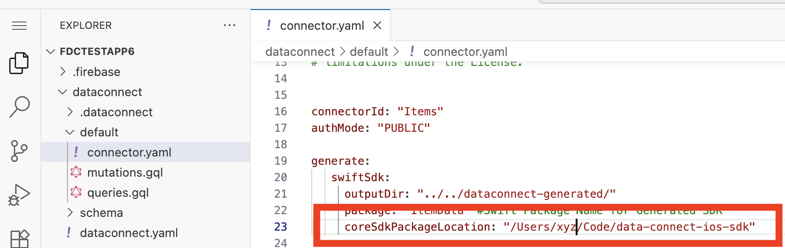
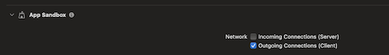

# Firebase Data Connect iOS Open Source Development

This repository contains the source code of Firebase Data Connect Swift SDKs for development on iOS and other Apple platforms.

Firebase Data Connect (https://firebase.google.com/docs/data-connect) lets you build applications with CloudSQL for PostgreSQL.

* Native Swift SDK.
* Observable Queries support binding to SwiftUI.
* Async APIs.
* Generated Swift SDKs to match your custom schemas and queries.

Firebase is an app development platform with tools to help you build, grow, and
monetize your app. More information about Firebase can be found on the
[official Firebase website](https://firebase.google.com).

## Installation

This process shows you how to setup Firebase Data Connect tools with Xcode.

* Get the Firebase Data Connect iOS SDK.
    ```
    git clone https://github.com/firebase/data-connect-ios-sdk.git
    ```

* Add it as a local package dependency in your Xcode project. If you are new to Firebase Data Connect, we suggest using a fresh SwiftUI app project.

    * From your Xcode project, select `File -> Add Package Dependencies -> Add Local`.
    * Select the `data-connect-ios-sdk` folder containing the cloned SDK.
    * Add `FirebaseDataConnect` to your app target.

* Add and Edit Xcode Scheme
    * From your list of schemes, select `New Scheme`.
    * Xcode should show you `Start FDC Tools` as a potential scheme. Select that.

* Adjust working directory
    * Edit the `Start FDC Tools` Scheme from  `Edit Scheme... -> Start FDC Tools`.
    * Go to `Run -> Options -> Working Directory`
        * Select `Custom working directory` and pick your Xcode project folder
        * This ensures that Firebase Data Connect tools start in the correct folder each time.

* Run the `Start FDC Tools` target selecting `My Mac` as the device.

* This should start the tools in a separate browser window (or tab).

* Follow the Quick Start below to start using FDC.


## Quick Start

### Data Connect Extension

Switch to the FDC Extension view and Sign In with a Google account.


### Start the Firebase Data Connect Emulator

Once signed in, start the FDC Emulator.


### Generate Typesafe Swift SDKs

From the FDC tools, modify the `dataconnect/default/connector.yaml` file to specify the location of the cloned  `data-connect-ios-sdk` by updating the `coreSdkPackageLocation` property.




The `swiftSdk` configuration sets up the location where FDC tools will generate a typesafe Swift SDK layer to match your schema and queries.

On saving the configuration, you should see a new folder called `dataconnect-generated` as a peer to the `dataconnect` folder. This folder contains the generated Swift SDK.


### Add Generated SDK Package Dependency

* Switch back to Xcode.

* From your Xcode project *File -> Add Package Dependencies -> Add Local -> Pick the package folder within `dataconnect-generated` folder (see previous step)*


### Add GoogleService-Info.plist to your project

* Right click on your Xcode project and select *“Add Files to ...”*

* Select a file called `GoogleService-Info.plist` from your Xcode project folder and add it as a Reference.

*Note:* When you are ready to test on a real device, you will need to setup a Firebase project and download a project specific `GoogleService-Info.plist` file.


### Initialize Firebase SDKs

* Open your `MyXYZApp.swift` file - this is the file which contains the `@main` attribute.

* Add the following imports to this file

    ```swift
        import Firebase
        import FirebaseDataConnect
        import ItemData
    ```

* Add an `init()` function to the main app `struct` if you don’t have one and add the two lines below. This will initialize the Firebase and Data Connect SDKs and set them up to use the emulator that you started earlier.

    ```swift
        init() {
            FirebaseApp.configure()

            DataConnect.itemsConnector.useEmulator()
        }
    ```


### Execute Mutation

* Open a SwiftUI view of the app and add the following imports.

    ```
        import FirebaseDataConnect
        import ItemData
    ```

* Within the `View` definition add a SwiftUI Button

    ```swift
    struct ContentView: View {
        VStack {
            Button("Create Item") {
                Task {
                    let result = try await DataConnect.itemsConnector.createItemMutation.execute(id: UUID(), name: "Item-\(Int.random(in: 1...1000))")

                        print("Created Item \(result)")
                }
            }
        }
    }
    ```


The code calls a predefined mutation called `CreateItem`. The generated SDK that was earlier added to the Xcode project added the `itemsConnector` and mutation call definitions from its original GraphQL definition. If you want to explore, see the `dataconnect/schema/schema.gql` and `dataconnect/default/mutations.gql` files.


### Run app in iPhone simulator

Run your app in an iPhone simulator and click on the `Create Item` button. You should see the print statement executed.

Note: You may need to enable Network capabilities for outgoing connections.




### Execute Query

Now that you have added an Item, lets run a query to fetch the item that was added

* Update your SwiftUI view to get a `QueryRef`

    ```swift
        struct ContentView: View {
            var itemsQueryRef = DataConnect.itemsConnector.listItemsQuery.ref()

            // ...
        }

    ```

* Now add a `Button` and `List` to which the results are bound for display.

    ```swift
        struct ContentView: View {
            var itemsQueryRef = DataConnect.itemsConnector.listItemsQuery.ref()

            var body: some View {
                VStack {

                // previous CreateItem button here

                Button("Execute Query") {
                    Task {
                        _ = try await DataConnect.itemsConnector.listItemsQuery.execute()
                    }
                }

                if let items = itemsQueryRef.data?.items {
                    List(items) { itemData in
                        Text(itemData.name)
                    }
                }
            }

        }


    ```


QueryRefs support the `Observation` framework (`@Observable` macro) and their results can be bound to SwiftUI views.

`execute()` function causes the query to reload results and due to `Observation`, the UI is also updated.


### Conclusion

Thats it! You now have a Firebase Data Connect project that inserts data and reads data for a simple  schema and queries.

### Follow up Exercise

As a next step, try modifying the schema by adding a new field called `price` of type `Float`.

*Hint:* Check comments in *schema.gql*, *mutations.gql*, *queries.gql*

As you change the GraphQL schema definitions, the Generated Swift SDK that you added earlier should automatically get updated with new field that you added.

## Next Steps

* Learn more about designing schemas, queries and mutations - [Design Schemas](https://firebase.google.com/docs/data-connect/schemas-guide).

* Try the [Codelab](https://firebase.google.com/codelabs/firebase-dataconnect-ios#0).

* Comprehensive Sample app - [FriendlyFlix](https://github.com/firebase/data-connect-ios-sdk/tree/main/Examples/FriendlyFlix).

* To connect to the Firebase Data Connect service and access it from a physical device visit the [Console](https://console.firebase.google.com) .

## Contributing

See [Contributing](CONTRIBUTING.md) for more information on contributing to the Firebase Data Connect
iOS SDK.

## License

The contents of this repository are licensed under the
[Apache License, version 2.0](http://www.apache.org/licenses/LICENSE-2.0).

Your use of Firebase is governed by the
[Terms of Service for Firebase Services](https://firebase.google.com/terms/).
