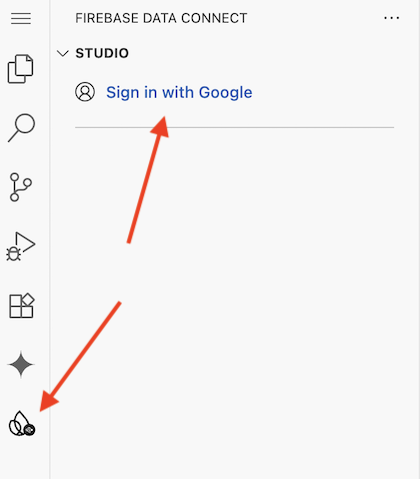
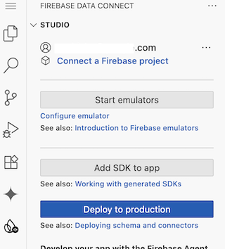

# Firebase Data Connect for Swift

**Connect your Swift & SwiftUI apps directly to a managed Google CloudSQL (PostgreSQL) database.**

This repository contains the official open-source Swift SDK for [Firebase Data Connect](https://firebase.google.com/docs/data-connect), a service that lets you build modern, data-driven applications on Apple platforms (iOS, macOS, etc.) with the power and scalability of a SQL database.

This SDK is perfect for those:
* Who need a robust SQL database for their app but want to avoid writing and managing a separate backend.
* Looking for a type-safe, async-first library to integrate a PostgreSQL database into their applications.

---

## ✨ Why Use Firebase Data Connect?

* **Use power of SQL:** Get the power of a managed PostgreSQL database without the hassle of managing servers. Focus on your app's frontend experience.
* **Type-Safe & Modern Swift:** Interact with your database using a strongly-typed, auto-generated Swift SDK. It's built with modern `async/await` for clean, concurrent code.
* **Built for SwiftUI:** `@Observable Queries` automatically update your SwiftUI views when data changes, making it incredibly simple to build reactive UIs.
* **Full CRUD Operations:** Define your data models and operations using GraphQL, and Data Connect generates the Swift code to query, insert, update, and delete data.
* **Local Emulator:** Develop and test your entire application locally with the FDC emulator for a fast and efficient development cycle.

---

## 🚀 Getting Started

This guide will walk you through setting up a new iOS (or other Apple platform) project with Firebase Data Connect.

### Prerequisites

* Xcode 15.0 or later
* iOS 15.0 or later
* A Google account for the FDC tools

### Step 1: Get the SDK & Tools

First, clone this repository to your local machine. This contains both the core SDK and the command-line tools needed for code generation.

```bash
git clone https://github.com/firebase/data-connect-ios-sdk.git
```

### **Step 2: Configure Your Xcode Project**

1. **Add Local Package:** In Xcode, open your app project and navigate to **File \> Add Package Dependencies...**.
2. In the package prompt, click **"Add Local..."** and select the `data-connect-ios-sdk` folder you just cloned.
3. Add the `FirebaseDataConnect` library to your app's primary target.

### **Step 3: Run the Data Connect Tools**

The Data Connect tools run on your Mac to provide a local development emulator and code generation service.

1. **Add New Scheme:** In Xcode's scheme menu, select **New Scheme...**. Choose the **`Start FDC Tools`** target and click OK.
2. **Set Working Directory:** Edit the new `Start FDC Tools` scheme. Go to **Run \> Options** and check **"Use custom working directory"**. Set this to the root folder of your Xcode project. **Run the Tools:** Select the `Start FDC Tools` scheme with **My Mac** as the destination and click Run (▶). This will open the FDC tools in your web browser.

### **Step 4: Generate Your Type-Safe Swift SDK**

The tools will generate a custom Swift package based on your database schema.

1. **Sign In:** In the FDC tools web UI, sign in with your Google account.



2. **Start Emulator:** Click the button to start the local FDC Emulator.



3. **Generate Code:** The tools will automatically detect the GraphQL schema (`.gql` files) in your project's `dataconnect` subfolder and generate a new Swift package in a `dataconnect-generated` folder.
4. **Reference cloned SDK:** From the FDC tools, modify the `dataconnect/default/connector.yaml` file to specify the location of the cloned `data-connect-ios-sdk` by updating the `coreSdkPackageLocation` property.
5. **Add Generated SDK to Xcode:** Back in Xcode, add another local package (**File \> Add Package Dependencies... \> Add Local...**). This time, select the new Swift package inside the `dataconnect-generated` folder. Add this new library (e.g., `ItemData`) to your app target.
6. **Add GoogleService-Info.plist to Xcode:** From Xcode. add a file to your project (**File \> Add Files to ...**). Select the file `GoogleService-Info.plist` thats in your Xcode project folder and add it as a `Reference`.

### **Step 5: Initialize Firebase in Your App**

In your main app file (the one with `@main`), initialize Firebase and configure Data Connect to use the local emulator.

Swift

```
// MyApp.swift
import SwiftUI
import Firebase
import FirebaseDataConnect
import ItemData // The name of your generated SDK package

@main
struct MyApp: App {
  init() {
    // 1. Configure Firebase
    FirebaseApp.configure()

    // 2. Point Data Connect to the local emulator
    DataConnect.itemsConnector.useEmulator()
  }

  var body: some Scene {
    WindowGroup {
      ContentView()
    }
  }
}
```

### **Step 6: Execute a Mutation (Create Data)**

Now you can write data to the database from any SwiftUI view.

Swift

```
// ContentView.swift
import SwiftUI
import FirebaseDataConnect
import ItemData

struct ContentView: View {
  var body: some View {
    VStack {
      Button("Create Item") {
        Task {
          do {
            let itemID = UUID()
            let itemName = "Item-\(Int.random(in: 1...1000))"
            let result = try await DataConnect.itemsConnector.createItemMutation.execute(id: itemID, name: itemName)
            print("✅ Successfully created item: \(result)")
          } catch {
            print("❌ Error creating item: \(error)")
          }
        }
      }
    }
  }
}
```

*Note:* You may need to enable `App Sanbbox` -> `Outgoing Connections (Client)` for your Xcode app target to run it from iPhone simulator.


### **Step 7: Execute a Query (Read & Display Data)**

Use a `QueryRef` to fetch data and automatically bind it to your SwiftUI view.

Swift

```
// ContentView.swift
import SwiftUI
import FirebaseDataConnect
import ItemData

struct ContentView: View {
  // A reference to our query
  @State var itemsQueryRef = DataConnect.itemsConnector.listItemsQuery.ref()

  var body: some View {
    VStack {
      // (Create Button from previous step)

      // The List will update when the query data changes
      if let items = itemsQueryRef.data?.items {
        List(items) { item in
          Text(item.name)
        }
      }

      Button("Refresh List") {
        Task {
          // Manually refetch the data
          _ = try? await itemsQueryRef.execute()
        }
      }
    }
    .task {
        // Fetch initial data when the view appears
        _ = await itemsQueryRef.execute()
    }
  }
}
```

**That's it\!** You've connected your app to a local SQL database, created a new record, and displayed a list of records in your UI.

---

## **📚 Next Steps**

* **Stretch Goal:** Modify the `schema.gql`, `queries.gql` and `mutations.gql` to add a `price` field to the `Item` entity. The generated SDK should get automatically created. *Hint:* See comments in the files.
* **Codelab:** Follow our detailed [Firebase Data Connect for iOS Codelab](https://firebase.google.com/codelabs/firebase-dataconnect-ios#0).
* **Schema Design:** Learn more about designing schemas, queries, and mutations in the [official documentation](https://firebase.google.com/docs/data-connect/schemas-guide).
* **Sample App:** Explore a complete sample application, [FriendlyFlix](https://github.com/firebase/data-connect-ios-sdk/tree/main/Examples/FriendlyFlix), to see more advanced usage patterns.
* **Go to Production:** When you're ready to deploy, visit the [Firebase Console](https://console.firebase.google.com) to connect to a live CloudSQL (PostgreSQL) instance.

---

## **🤝 Contributing**

Please see the [Contributing](https://www.google.com/search?q=CONTRIBUTING.md) guide for more information.

## **📄 License**

This repository is licensed under the [Apache License, version 2.0](http://www.apache.org/licenses/LICENSE-2.0). Your use of Firebase is governed by the [Terms of Service for Firebase Services](https://firebase.google.com/terms/).
