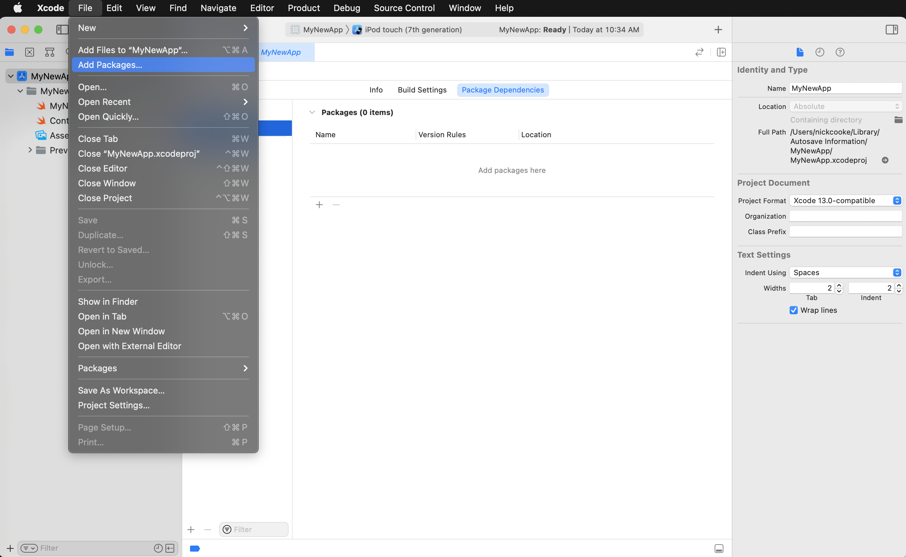
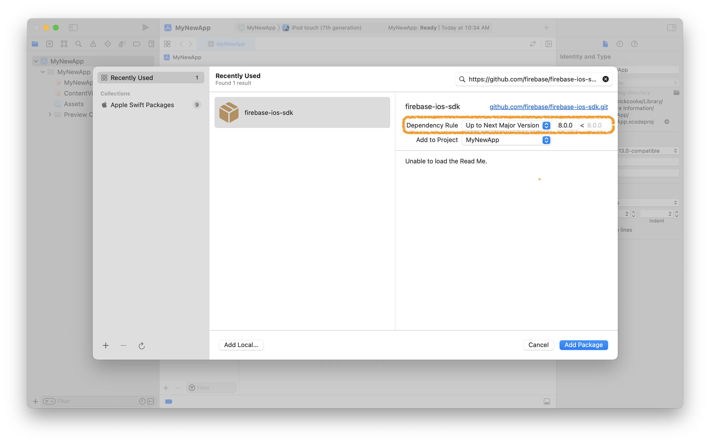

# Swift Package Manager for Firebase

## Requirements

- Requires Xcode 15.2 or above
- See [Package.swift](Package.swift) for supported platform versions.

## Installation

### Installing from Xcode

Add a package by selecting `File` → `Add Packages…` in Xcode’s menu bar.



---

Search for the Firebase Data Connect Apple SDK using the repo's URL:
```console
https://github.com/firebase/data-connect-ios-sdk.git
```

Next, set the **Dependency Rule** to be `Up to Next Major Version`.

Then, select **Add Package**.



---

Choose the product FirebaseDataConnect to install in your app.


### Alternatively, add Firebase Data Connect to a `Package.swift` manifest

To integrate via a `Package.swift` manifest instead of Xcode, you can add
Firebase Data Connect to the dependencies array of your package:

```swift
dependencies: [
  .package(
    url: "https://github.com/firebase/data-connect-ios-sdk.git",
    .upToNextMajor(from: "11.3.0")
  ),

  // Any other dependencies you have...
],
```

Then, in any target that depends on Firebase Data Connect, add it to the `dependencies`
array of that target:

```swift
.target(
  name: "MyTargetName",
  dependencies: [
    .product(name: "FirebaseDataConnect", package: "data-connect-ios-sdk"),
  ]
),
```

## Questions and Issues

Please provide any feedback via a [GitHub
Issue](https://github.com/firebase/firebase-ios-sdk/issues/new?template=bug_report.md).

See current open Swift Package Manager issues
[here]([https://github.com/firebase/firebase-ios-sdk/labels/Swift%20Package%20Manager](https://github.com/firebase/firebase-ios-sdk/issues?q=is%3Aopen+label%3A%22Swift+Package+Manager%22+sort%3Acomments-desc)).
